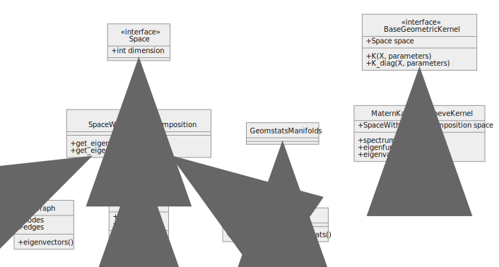

**WARNING: this is a development (unstable) version of the package**


# Geometric Kernels

This package implements a suite of Geometric kernels.




##  Installation

1. [Prerequisite] install [LAB](https://github.com/wesselb/lab) following [the these instructions](https://gist.github.com/wesselb/4b44bf87f3789425f96e26c4308d0adc).

2. Clone the repository.
```bash
git clone https://github.com/GPflow/GeometricKernels.git
```

3. Move (`cd`) to the root directory of GeometricKernels and install it in the active environment
```bash
pip install -e .
```

4. Install a backend of your choice

We use [LAB](https://github.com/wesselb/lab) to support multiple backends (e.g., TensorFlow, Jax, PyTorch). However, you are not required to install all of them on your system to use the Geometric Kernel package. Simply install the backend (and GP package) of your choice. For example,

- TensorFlow and GPflow
```
pip install tensorflow tensorflow-probability gpflow
```
then import as follows
```
import geometric_kernels.tensorflow  # noqa
import tensorflow as tf
```

- PyTorch and GPyTorch
```
pip install torch gpytorch
```
then import as follows
```
import geometric_kernels.pytorch  # noqa
import torch
```


### Supported backends with associated GP packaes

Ready|Backend                                      | GP package
-----|---------------------------------------------|------------------------------------------
✅   |[Tensorflow](https://www.tensorflow.org/)    |[GPflow](https://github.com/GPflow/GPflow)
✅   |[PyTorch](https://github.com/pytorch/pytorch)|[GPyTorch](https://gpytorch.ai/)
✅   |[Numpy](https://numpy.org/)                  |??
🚧   |[Jax](https://github.com/google/jax)         |??
 

## For development and running the tests

Run these commands from the root directory of the repository. 

Install all backends (currently PyTorch and TensorFlow) and the dev requirements (Pytest, black, etc.)
```bash
pip install -r dev_requirements.txt -r requirements.txt
```

Run the tests
```bash
make test
```