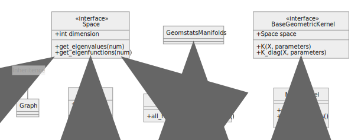

# Geometric Kernels

This package implements a suite of geometric kernels.



## Installation

We recommend using [`poetry`](https://python-poetry.org/) to install this `GeometricKernels`. Poetry manages your package, python version and other dependencies. Alternatively, virtual environments can be used.

If Poetry is not yet installed on your system, run the following command
**(Skip if you've got `poetry` on your system already)**:
```bash
curl -sSL https://raw.githubusercontent.com/python-poetry/poetry/master/get-poetry.py | python -
```
Next, run
```bash
poetry run pip install --upgrade pip
```
Followed by
```bash
poetry install
```
You can then get a shell with the environment via `poetry shell`.

## Running the tests

Run these commands from the root directory of this repository. 
To run the full test suite, including pylint and Mypy, run: 

```bash
poetry run task test
```

Alternatively, you can run just the unit tests, starting with the failing tests and exiting after
the first test failure:

```bash
poetry run task quicktest
```

**NOTE:** Running the tests requires
that the project virtual environment has been updated. See [Installation](#Installation).

## Adding new Python dependencies

- To specify dependencies required by `GeometricKernels`, run `poetry add`.
- To specify dependencies required to build or test the project, run `poetry add --dev`.
