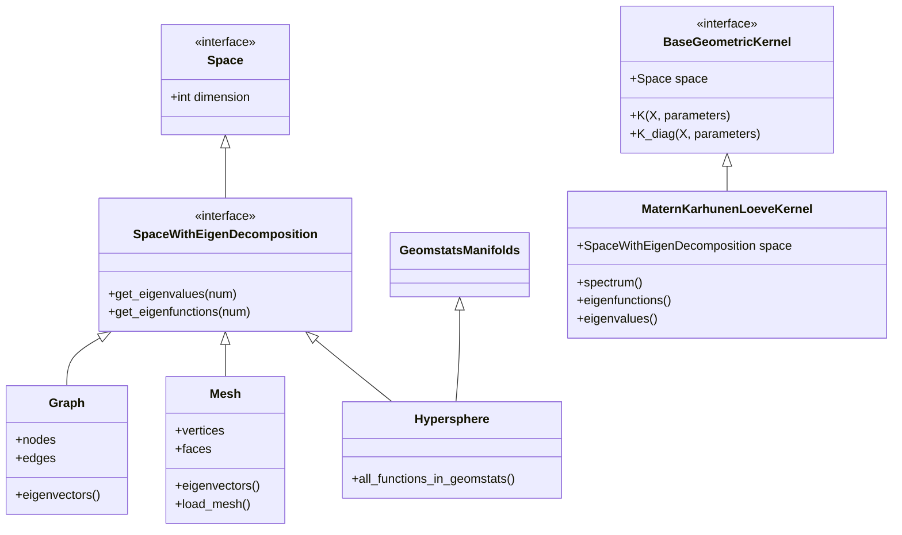

```mermaid
classDiagram
Space <|-- SpaceWithEigenDecomposition
SpaceWithEigenDecomposition <|-- Graph
SpaceWithEigenDecomposition <|-- Mesh
SpaceWithEigenDecomposition <|-- Hypersphere
GeomstatsManifolds <|-- Hypersphere
BaseGeometricKernel <|-- MaternKarhunenLoeveKernel


class GeomstatsManifolds

class Space{
	<<interface>>
	+int dimension
}

class SpaceWithEigenDecomposition{
	<<interface>>
	+get_eigenvalues(num)
	+get_eigenfunctions(num)
}

class Graph {
    +nodes
    +edges
    +eigenvectors()
}

class Mesh {
	+vertices
	+faces
	+eigenvectors()
	+load_mesh()
}
	
class Hypersphere {
	+all_functions_in_geomstats()
}

class BaseGeometricKernel {
	<<interface>>
	+Space space
	+K(X, parameters)
	+K_diag(X, parameters)
}

class MaternKarhunenLoeveKernel {
	+SpaceWithEigenDecomposition space
	+spectrum()
	+eigenfunctions()
	+eigenvalues()
}
```