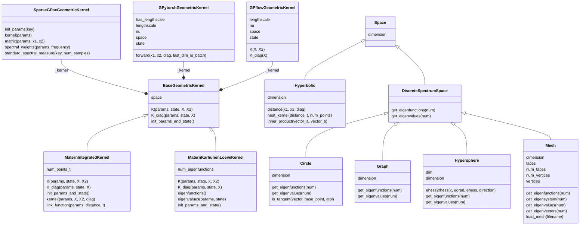

```mermaid
        classDiagram
          class BaseGeometricKernel {
            space
            K(params, state, X, X2) 
            K_diag(params, state, X)
            init_params_and_state()
          }
          class Circle {
            dimension
            get_eigenfunctions(num)
            get_eigenvalues(num)
            is_tangent(vector, base_point, atol)
          }
          class Hyperbolic {
            dimension
            distance(x1, x2, diag) 
            heat_kernel(distance, t, num_points)
            inner_product(vector_a, vector_b)
          }
          class DiscreteSpectrumSpace {
            get_eigenfunctions(num)
            get_eigenvalues(num) 
          }
          class GPflowGeometricKernel {
            lengthscale
            nu
            space
            state
            K(X, X2)
            K_diag(X)
          }
          class GPytorchGeometricKernel {
            has_lengthscale
            lengthscale
            nu
            space
            state
            forward(x1, x2, diag, last_dim_is_batch)
          }
          class Graph {
            dimension
            get_eigenfunctions(num)
            get_eigenvalues(num)
          }
          class Hypersphere {
            dim
            dimension
            ehess2rhess(x, egrad, ehess, direction)
            get_eigenfunctions(num)
            get_eigenvalues(num)
          }
          class MaternIntegratedKernel {
            num_points_t
            K(params, state, X, X2) 
            K_diag(params, state, X) 
            init_params_and_state()
            kernel(params, X, X2, diag)
            link_function(params, distance, t)
          }
          class MaternKarhunenLoeveKernel {
            num_eigenfunctions
            K(params, state, X, X2)
            K_diag(params, state, X)
            eigenfunctions()
            eigenvalues(params, state)
            init_params_and_state()
          }
          class Mesh {
            dimension
            faces
            num_faces
            num_vertices
            vertices
            get_eigenfunctions(num) 
            get_eigensystem(num) 
            get_eigenvalues(num) 
            get_eigenvectors(num) 
            load_mesh(filename)
          }
          class Space {
            dimension
          }
          class SparseGPaxGeometricKernel {
            init_params(key)
            kernel(params)
            matrix(params, x1, x2)
            spectral_weights(params, frequency)
            standard_spectral_measure(key, num_samples)
          }
BaseGeometricKernel <|-- MaternIntegratedKernel
BaseGeometricKernel <|-- MaternKarhunenLoeveKernel
SparseGPaxGeometricKernel  --* BaseGeometricKernel : _kernel
GPytorchGeometricKernel  --* BaseGeometricKernel : _kernel
GPflowGeometricKernel  --* BaseGeometricKernel : _kernel
Space <|-- Hyperbolic
Space <|-- DiscreteSpectrumSpace
DiscreteSpectrumSpace <|-- Circle
DiscreteSpectrumSpace <|-- Graph
DiscreteSpectrumSpace <|-- Hypersphere
DiscreteSpectrumSpace <|-- Mesh

```
